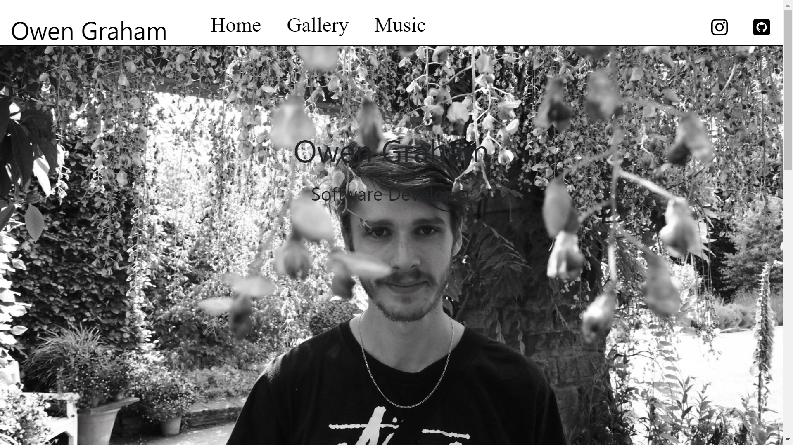
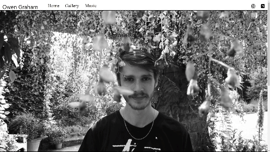
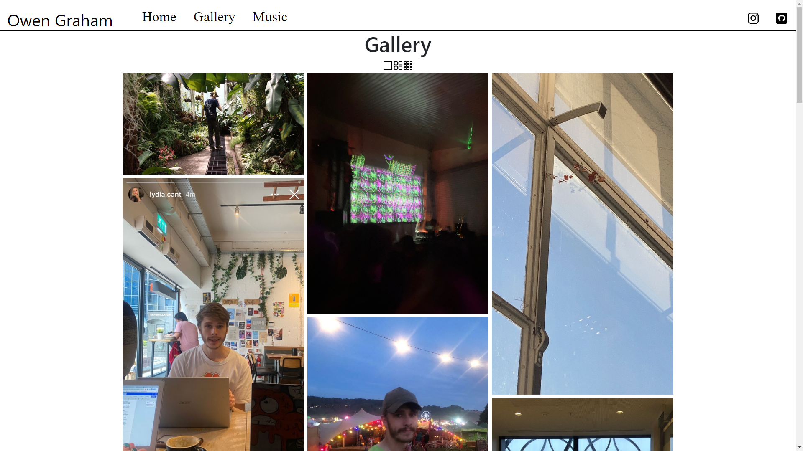
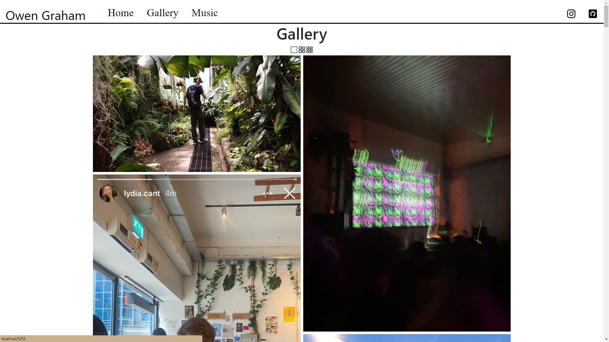
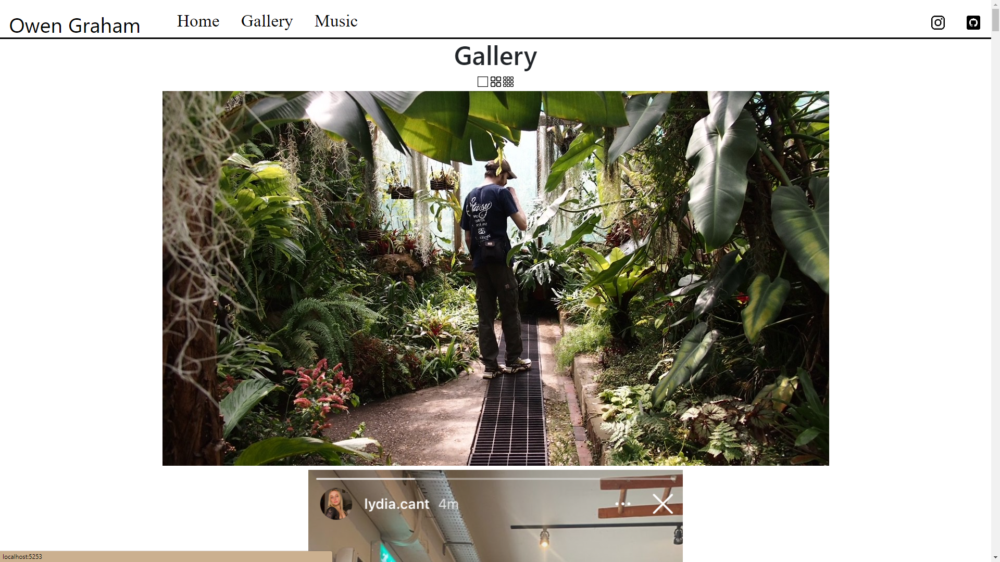
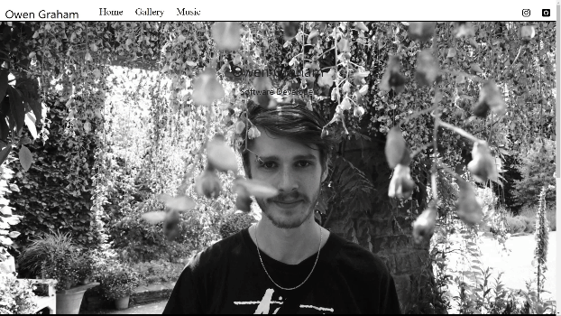
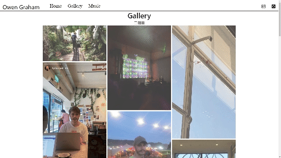
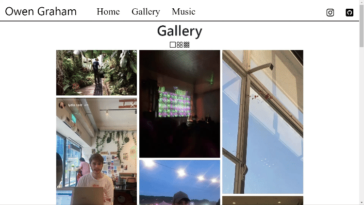

# Owen Graham's ASP.NET Website <!-- omit from toc -->

## Overview

This is an ASP.NET Core web application developed by Owen Graham to learn the fundamentals of web development using Razor Pages. The application features a home page, an image gallery, and embedded SoundCloud players showcasing songs I produced.

> Please note the site is a work in progress.

## Contents

- [Overview](#overview)
- [Contents](#contents)
- [Technologies Used](#technologies-used)
- [Features](#features)
- [Project Setup](#project-setup)
  - [Prerequisites](#prerequisites)
  - [Running the Application](#running-the-application)
- [Pages](#pages)
  - [Home Page](#home-page)
  - [Gallery Page](#gallery-page)

## Technologies Used

- **ASP.NET Core**: Web framework for building dynamic web applications.
- **Razor Pages**: Simplified page-based coding model for building UI.
- **JavaScript**: Used for interactivity and animations.
- **CSS/HTML**: For styling and layout.

## Features

- **Home Page**: Parallax scrolling effect with background images.
- **Gallery Page**: Grid layout of images with interactive animations and a lightbox feature.
- **Embedded Music Player**: Showcases songs produced by me using soundcloud.

## Project Setup

### Prerequisites

- [Dotnet SDK 8](https://dotnet.microsoft.com/en-us/download/dotnet/8.0)

### Running the Application

1. Clone the git repository

> `git clone https://github.com/OwenGraham/MyWeb.git`

1. Open a terminal and navigate to the reposiory root
2. Run the following command to run the app:

> `dotnet run`

4. Open the page by going to the URL printed in the terminal in a browser. For example if the output contains

```
info: Microsoft.Hosting.Lifetime[14]
Now listening on: http://localhost:5253
```

Open http://localhost:5253 in your browser.

## Pages

### Home Page



The home page of the website includes a parallax background. The background is a black and white image that remains static relative to the viewport when the user scrolls down the page, until they scroll past a horizontal bar after which the image is revealed in colour.



### Gallery Page



The gallery page is a collection of photographs I like displayed in a grid.

The user can change how large the images are by selecting the number of columns the grid has.

|  |  |  |
| ------------------------------------------------ | ------------------------------------------------ | ----------------------------------------------- |

The page contains several other JavaScript animations to make it more interactive and engaging:

- Images fade in on page load



- When mouse hovers over an image, all other images go slightly transparent:



Clicking an image opens an enlarged version of it with buttons to click through the images. The gallery page is made slightly transparent behind the enlarged image and controls:


