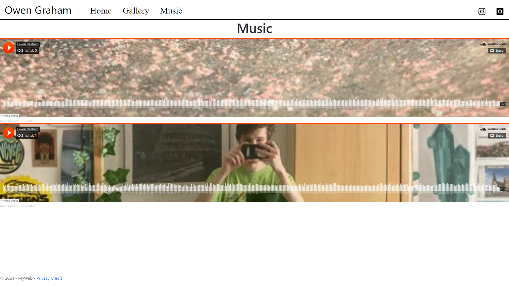

# Owen Graham's ASP.NET Website <!-- omit from toc -->

## Overview

This is an ASP.NET Core web application developed by Owen Graham to learn the fundamentals of web development using Razor Pages. The application features a home page, an image gallery, and embedded SoundCloud players showcasing songs I produced.

> Please note the site is a work in progress.

## Contents

- [Overview](#overview)
- [Contents](#contents)
- [Technologies Used](#technologies-used)
- [Features](#features)
- [Project Setup](#project-setup)
  - [Prerequisites](#prerequisites)
  - [Running the Application](#running-the-application)
- [Pages](#pages)
  - [Home Page](#home-page)
  - [Gallery Page](#gallery-page)
  - [Music Page](#music-page)

## Technologies Used

- **ASP.NET Core**: Web framework for building dynamic web applications.
- **Razor Pages**: Simplified page-based coding model for building UI.
- **JavaScript**: Used for interactivity and animations.
- **CSS/HTML**: For styling and layout.

## Features

- **Home Page**: Parallax scrolling effect with background images.
- **Gallery Page**: Grid layout of images with interactive animations and a lightbox feature.
- **Embedded Music Player**: Showcases songs produced by me using soundcloud.

## Project Setup

### Prerequisites

- [Dotnet SDK 8](https://dotnet.microsoft.com/en-us/download/dotnet/8.0)

### Running the Application

1. Clone the git repository: `git clone https://github.com/OwenGraham/MyWeb.git`

1. Open a terminal and navigate to the reposiory root
2. Run the following command to run the app: `dotnet run`

4. Open the app in your browser using the URL printed in the terminal, e.g., `http://localhost:5253`.

## Pages

### Home Page

The home page includes a parallax background effect, where the static image is revealed in color as the user scrolls down.

### Gallery Page

The gallery page displays a collection of photographs in a grid format. Users can adjust the size of the images by selecting the number of columns. The page also includes various animations for a more interactive experience.

  
  
  

The page contains several other JavaScript animations to make it more interactive and engaging:

- Images fade in on page load

- When mouse hovers over an image, all other images go slightly transparent:

Clicking an image opens an enlarged version of it with buttons to click through the images. The gallery page is made slightly transparent behind the enlarged image and controls:

### Music Page

The music page contains embedded ScoundCloud players to songs I produced using Ableton Live.